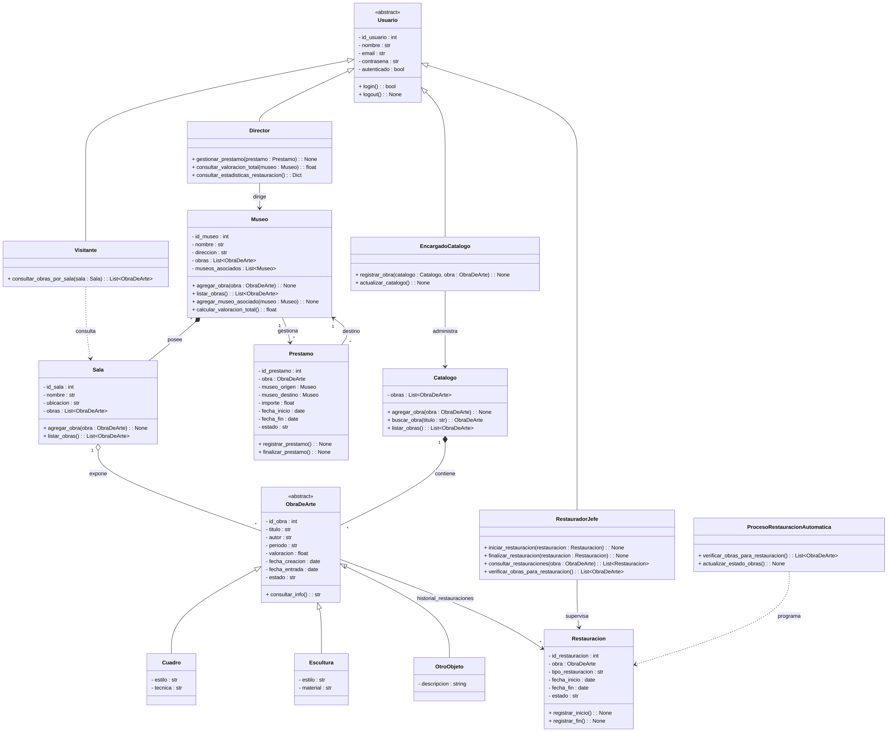

# Taller POO — Python y Java

## Universidad de La Salle — Ingeniería de Software
**Materia:** Lenguajes de Programación II  
**Profesor:** Rodrigo Aranda Fernández  
**Estudiante:** Diunis Perez  

---

## Descripción

Soluciones orientadas a objetos para dos ejercicios del Taller de POO, implementados en Python y Java. Ambos proyectos aplican principios S.O.L.I.D., estándares PEP8 (Python) y Clean Code (Java), con herencia, clases abstractas, polimorfismo y encapsulamiento.

---

## Estructura del Repositorio

```
TALLERPOO/
├── TeleVentas/              # Ejercicio 1 — Python
├── Televentas Java/         # Ejercicio 1 — Java
├── MuseoPOO/                # Ejercicio 2 — Python
├── Museo Java/              # Ejercicio 2 — Java
├── TeleventasUML.jpeg       # Diagrama UML TeleVentas
├── diagrama_museo.png       # Diagrama UML Museo
├── README.md
└── .gitignore
```

---

## Ejercicio 1: Sistema TeleVentas

### Descripción
Sistema orientado a objetos para soporte de compras a distancia. Permite a los clientes consultar el catálogo de productos, realizar órdenes de compra con pago por tarjeta de crédito, presentar quejas y gestionar pedidos. Incluye control de acceso por roles.

### Diagrama UML


### Cómo Ejecutar

**Python:**
```bash
cd TeleVentas
python main.py
```

**Java:**
```bash
cd "Televentas Java/src"
javac *.java
java Main
```

### Usuarios de Prueba

| Rol | Usuario | Contraseña |
|-----|---------|------------|
| Cliente | Diunis Perez | 1234 |
| Agente de Depósito | Carlos | 5678 |
| Gerente de Relaciones | Laura | abcd |

### Funcionalidades por Rol

| Funcionalidad | Cliente | Agente | Gerente |
|---------------|---------|--------|---------|
| Ver catálogo | ✅ | ✅ | ✅ |
| Buscar producto | ✅ | ✅ | ✅ |
| Comprar y pagar | ✅ | ❌ | ❌ |
| Crear pedido | ❌ | ✅ | ❌ |
| Presentar queja | ✅ | ❌ | ❌ |
| Agregar producto | ❌ | ❌ | ✅ |

### Clases Principales
- **Usuario (ABC)** → Cliente, AgenteDeposito, GerenteRelaciones
- **Pago (ABC)** → TarjetaDeCredito
- Producto, Catalogo, OrdenDeCompra, DetallePedido, Pedido, Queja, Direccion

### Principios S.O.L.I.D.

| Principio | Aplicación |
|-----------|------------|
| **S** — SRP | Cada clase tiene una sola responsabilidad |
| **O** — OCP | Pago es abstracta y extensible (PayPal, PSE sin modificar código) |
| **L** — LSP | TarjetaDeCredito sustituye a Pago sin romper el contrato |
| **I** — ISP | Cada rol solo accede a las funcionalidades que necesita |
| **D** — DIP | El sistema depende de la abstracción Pago, no de TarjetaDeCredito |

---

## Ejercicio 2: Sistema de Gestión del Museo

### Descripción
Sistema orientado a objetos para la gestión integral de un museo de arte. Permite administrar el catálogo de obras (cuadros, esculturas, otros objetos), gestionar restauraciones manuales y automáticas cada 5 años, controlar préstamos entre museos y consultar obras por sala.

### Diagrama UML


### Cómo Ejecutar

**Python:**
```bash
cd MuseoPOO
python main.py
```

**Java:**
```bash
cd "Museo Java/src"
javac *.java
java Main
```

### Usuarios de Prueba

| Rol | Usuario | Contraseña |
|-----|---------|------------|
| Director | Carlos Méndez | dir123 |
| Encargado Catálogo | Laura Gómez | cat123 |
| Restaurador Jefe | Pedro Ramírez | res123 |
| Visitante | (sin login) | — |

### Funcionalidades por Rol

| Funcionalidad | Director | Encargado | Restaurador | Visitante |
|---------------|----------|-----------|-------------|-----------|
| Valoración total | ✅ | ❌ | ❌ | ❌ |
| Gestionar préstamos | ✅ | ❌ | ❌ | ❌ |
| Registrar obras | ❌ | ✅ | ❌ | ❌ |
| Ver catálogo | ❌ | ✅ | ❌ | ❌ |
| Restauración manual | ❌ | ❌ | ✅ | ❌ |
| Restauración automática | ❌ | ❌ | ✅ | ❌ |
| Consultar obras por sala | ❌ | ❌ | ❌ | ✅ |

### Clases Principales
- **Usuario (ABC)** → Director, EncargadoCatalogo, RestauradorJefe
- **ObraDeArte (ABC)** → Cuadro, Escultura, OtroObjeto
- **Visitante** — No hereda de Usuario (principio ISP)
- Museo, Sala, Catalogo, Prestamo, Restauracion
- **ProcesoRestauracionAutomatica** — Servicio separado (principio SRP)

### Principios S.O.L.I.D.

| Principio | Aplicación |
|-----------|------------|
| **S** — SRP | ProcesoRestauracionAutomatica solo verifica y programa restauraciones |
| **O** — OCP | ObraDeArte es extensible sin modificar código existente |
| **L** — LSP | Cuadro, Escultura y OtroObjeto sustituyen a ObraDeArte sin romper el sistema |
| **I** — ISP | Visitante NO hereda de Usuario porque no necesita autenticación |
| **D** — DIP | Las clases dependen de abstracciones, no de implementaciones concretas |

---

## Conceptos POO Aplicados

- **Herencia:** Jerarquías de clases con extends/super en ambos ejercicios
- **Clases abstractas:** ABC con @abstractmethod (Python) / abstract class (Java)
- **Polimorfismo:** consultar_info() en Museo, procesar() en TeleVentas
- **Encapsulamiento:** Atributos privados con getters/setters explícitos

## Estándares de Codificación

- **Python:** PEP8 verificado con flake8 (max-line-length=88) — 0 errores
- **Java:** Clean Code con convenciones estándar de Java
- **Git:** Branching con main → develop → dev_dperez37
