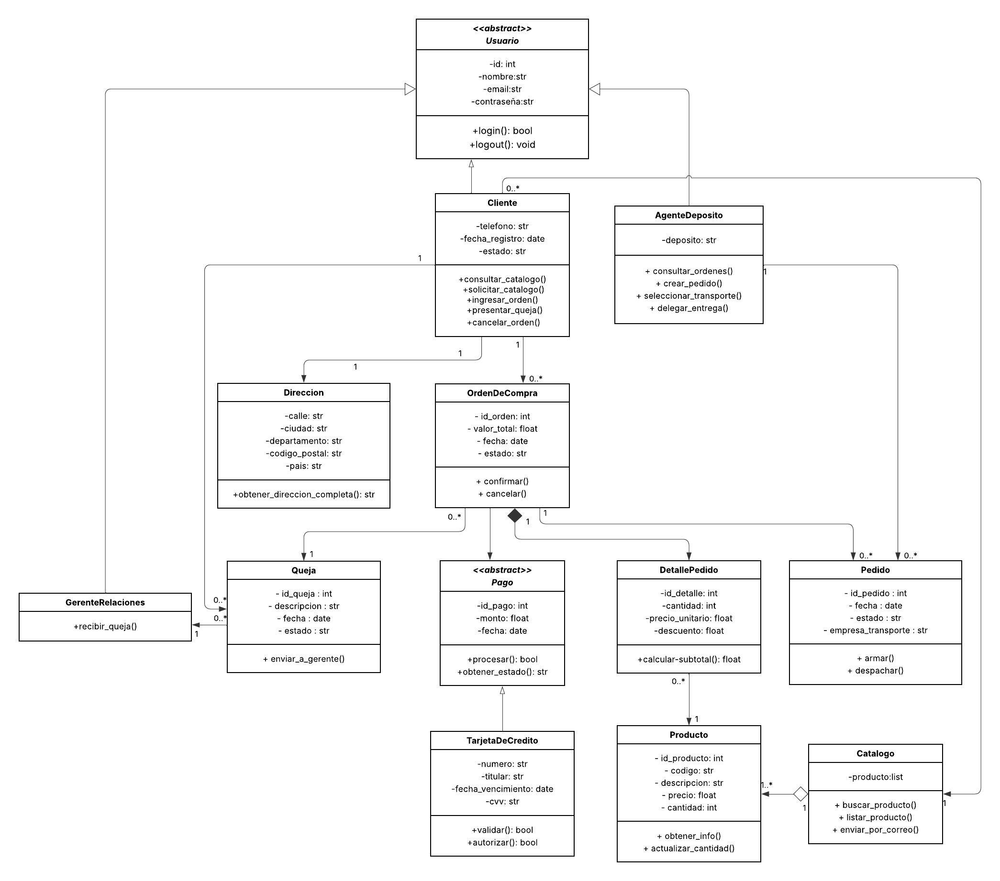

# Sistema TeleVentas - POO en Python

## Descripción

Sistema orientado a objetos para soporte de compras a distancia. Permite a los clientes consultar el catálogo de productos, realizar órdenes de compra con pago por tarjeta de crédito, presentar quejas y gestionar pedidos. Incluye control de acceso por roles.

## Diagrama UML



## Cómo Ejecutar

```bash
python main.py
```

El sistema presenta un menú interactivo con 3 roles:

| Rol | Usuario | Contraseña |
|-----|---------|------------|
| Cliente | Diunis Perez | 1234 |
| Agente de Depósito | Carlos | 5678 |
| Gerente de Relaciones | Laura | abcd |

## Estructura del Proyecto

```
TeleVentas-POO/
├── main.py                    # Programa principal interactivo
├── Clases
│   ├── __init__.py
│   ├── usuario.py             # Clase abstracta Usuario (ABC)
│   ├── cliente.py             # Hereda de Usuario
│   ├── agente_deposito.py     # Hereda de Usuario
│   ├── gerente_relaciones.py  # Hereda de Usuario
│   ├── producto.py            # Producto del catálogo
│   ├── catalogo.py            # Gestión de productos
│   ├── orden_compra.py        # Orden de compra
│   ├── detalle_pedido.py      # Detalle de cantidades y precios
│   ├── pedido.py              # Pedido físico para envío
│   ├── pago.py                # Clase abstracta Pago (ABC)
│   ├── tarjeta_credito.py     # Hereda de Pago
│   ├── queja.py               # Quejas de clientes
│   └── direccion.py           # Dirección de envío
```

## Funcionalidades por Rol

| Funcionalidad | Cliente | Agente | Gerente |
|---------------|---------|--------|---------|
| Ver catálogo  |    ✅   | ✅    |      ✅ |
| Buscar producto |  ✅   | ✅    |      ✅ |
| Comprar y pagar |  ✅   | ❌    |      ❌ |
| Crear pedido    |  ❌   | ✅    |      ❌ |
| Presentar queja |  ✅   | ❌    |      ❌ |
| Agregar producto | ❌   | ❌    |      ✅ |
| Ver datos cliente | ✅  | ✅    |      ✅ |
| Resumen del sistema | ✅| ✅    |      ✅ |

## Conceptos POO Aplicados

- **Herencia:** Usuario → Cliente, AgenteDeposito, GerenteRelaciones | Pago → TarjetaDeCredito
- **Clases abstractas:** Usuario (ABC) con login()/logout() abstractos | Pago (ABC) con procesar()/obtener_estado() abstractos
- **Polimorfismo:** `procesar()` y `obtener_estado()` implementados en TarjetaDeCredito
- **Encapsulamiento:** Atributos privados (`__atributo`) con getters/setters explícitos

## Principios S.O.L.I.D.

| Principio | Aplicación |
|-----------|------------|
| **S** - Single Responsibility | Cada clase tiene una sola responsabilidad (Catalogo gestiona productos, Queja gestiona quejas) |
| **O** - Open/Closed | `Pago` es abstracta y extensible (se puede agregar PayPal, PSE sin modificar código) |
| **L** - Liskov Substitution | `TarjetaDeCredito` sustituye a `Pago` sin romper el contrato |
| **I** - Interface Segregation | Cada rol solo accede a las funcionalidades que necesita |
| **D** - Dependency Inversion | El sistema depende de la abstracción `Pago`, no de `TarjetaDeCredito` |

## Estándares

- **PEP8:** Verificado con flake8 (max-line-length=88) — 0 errores
- **Branching:** main → develop → dev_dperez37

## Autor

- **Estudiante:** Diunis Perez
- **Materia:** Lenguajes de Programación II
- **Profesor:** Rodrigo Aranda Fernández
- **Universidad de La Salle** — Ciencia de Datos
